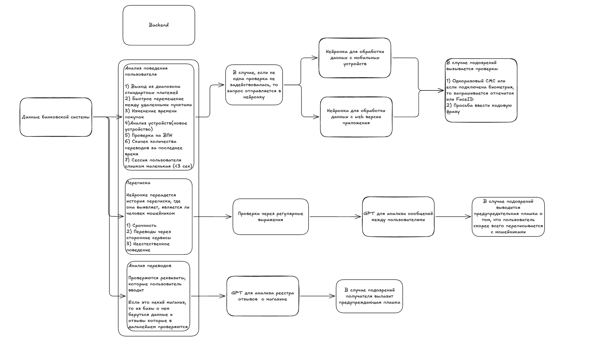

Ты Senior+ bakcend developer твоя задача реализовать поставленную перед тобой задачу

Описание задачи по тз:
Дорожка 2. Антифрод и поведенческая безопасность
Проблема:
В последнее время резко выросло количество фишинга, подмены номеров,
социнженерии и утечек данных. Банки хотят внедрять поведенческую
антифрод-защиту, но не знают, какие именно признаки и модели реально работают
быстро и без больших бэкендов.
Что нужно сделать
Разработать прототип системы поведенческого скоринга фрода, который работает в
реальном времени (на клиенте или лёгком бэкенде).
Вы сами решаете:
● Какие признаки собирать (данные с браузера / устройства / сессии).
● Какую модель или эвристику использовать (rule-based, ML, ансамбль).
● Как интерпретировать результат (безопасно / подозрительно / нужен challenge).
● Какие challenge-механизмы предложите (селфи, вопрос, капча, другое).
Опционально (для продвинутого решения)
● Анализ фишинговых фраз в сообщениях (например, через мини-LLM или
регулярки с весами).
● Адаптация под мобильные устройства (тач + акселерометр).
● Merchant Risk Monitor: выявление фейковых интернет-магазинов (мошенники
быстро создают fake-shops, подключают прием платежей и исчезают после
волны оплат.)
Критерии оценки (что проверяем)
● Качество обнаружения: Реалистичность и неочевидность выбранных аномалий
● Архитектура: Простота интеграции, скорость, конфиденциальность
● Обоснование: Почему вы выбрали именно эту модель / признаки
● Работоспособность challenge: Не заглушка, а интерактивный запрос к
пользователю
● Время ответа на транзакцию — не более 1 секунды на нормальном действии.

Наша предполагаемая структура описана на скриншоте
Нужно чтобы backend получал данные в нашем случае это просто могут быть mock данные для тестов

И на нем должны обрабатываться следующие случаи:
Первый случай
Анализ поведения пользователя

1) Выход из диапозона стандартных платежей
2) Быстрое перемещение между удаленными пунктами
3) Изменение времени покупок
4) Анализ устройств(новое устройство)
5) Проверка на ВПН
6) Скачек количества переводов за последнее время
7) Сессия пользователя слишком маленькая (<3 сек)

Если эти условия все проходят, то дальше запрос отправляется к обученной нейронке

Второй случай
Переписка

Сначала идет проверка сообщений из json в которой текс стравнивается с регулярными выражениями, которые могут быть использованы в сообщении от мошейника

Если все они проходят, то все сообщения у поля из структуры json передаются в развернутую локально нейронку

Трейтий случай
Анализ переводов

Проверяются реквизиты, которые пользователь вводит в развернутую локально нейронку.
Если это некий маганиз, то из базы о нем беруться данные и отзывы которые в дальнейшем проверяются самой нейронкой.

В случае если у нас заподозрен мошейник в переписке или сомнительный магазин, то мы банковскому сервису должны вернуть некторое число, которое будет к примеру в диапозоне от 0 до 10 где 0 он не мошейник, а 10 что он точно мошейник. В дальнейшем (это будет уже реализовано не нами) пользователю будет выведена плашка с предупреждением

Если у нас заподозрен аккаунт мошейника по анализу поведения пользователя, то мы тоже возвращаем сервису число от 0 до 10, но в этом случае (опять же это будет реализовываться не нами) будет запрашиваться биометрия или подтверждение через смс взависимости насколько мы уверены в том, что это мошейник

Структура всех json-ов
Что отправляется с мобильной версии
customer_id — ID клиента банка
event_id — Уникальный ID операции
session_id — ID сессии
device_id — Уникальный идентификатор устройства
installation_id — ID установки приложения (сбрасывается при переустановке)
app_version — Версия мобильного приложения
os_type — Тип ОС (iOS/Android)
os_version — Версия операционной системы
device_model — Модель устройства
event_dttm — Дата и время операции
hour_of_day — Час совершения операции (0-23)
day_of_week — День недели (0-6)
operaton_amt — Сумма операции в рублях
currency_iso_cd — Код валюты операции
mcc_code — MCC-код категории продавца
merchant_name — Название магазина/получателя
pos_cd — Код условия проведения операции
transaction_type — Тип транзакции (p2p/оплата/снятие/перевод)
attestation_status — Результат аппаратной аттестации устройства
is_rooted_jailbroken — Флаг наличия root/jailbreak
is_emulator — Флаг запуска в эмуляторе
is_debugger_attached — Флаг подключения отладчика
developer_tools_enabled — Включены ли настройки разработчика
app_install_source — Источник установки приложения (официальный/сторонний)
integrity_token — Токен проверки целостности (Play Integrity/DeviceCheck)
connection_type — Тип подключения (wifi/cellular/5g/4g)
carrier_name — Название мобильного оператора
carrier_mcc — Код страны оператора
carrier_mnc — Код сети оператора
ip_address_hash — Хеш IP-адреса
is_vpn_detected — Флаг использования VPN
is_proxy_detected — Флаг использования прокси
network_rtt_avg_ms — Среднее время сетевого отклика
sim_country_code — Код страны SIM-карты
sim_carrier_name — Название оператора SIM
latitude — Широта местоположения
longitude — Долгота местоположения
accuracy_meters — Точность геолокации в метрах
location_provider — Источник геолокации (gps/network/passive)
timezone_offset_minutes — Смещение часового пояса
geo_speed_km_h — Скорость перемещения от последней точки
touch_typing_rhythm_median_ms — Медианное время между касаниями
touch_typing_rhythm_std_dev — Стандартное отклонение скорости ввода
touch_typing_rhythm_cv — Коэффициент вариации ритма ввода
tap_velocity_avg — Средняя скорость нажатий
tap_pressure_avg — Среднее давление нажатия (если доступно)
touch_jitter_score — Оценка дрожания пальца
swipe_angle_deviation — Отклонение угла свайпа
clipboard_paste_ratio — Доля вставок из буфера обмена
backspace_ratio — Доля нажатий клавиши назад
form_fill_duration_sec — Время заполнения формы
app_background_events — Количество сворачиваний приложения
screen_orientation_changes — Количество поворотов экрана
accelerometer_variance_x — Дисперсия акселерометра по оси X
accelerometer_variance_y — Дисперсия акселерометра по оси Y
gyroscope_variance — Дисперсия гироскопа
biometric_entry_used — Флаг входа по биометрии
battery_level — Уровень заряда батареи
battery_charging_state — Статус зарядки устройства
storage_free_percent — Процент свободной памяти

Что отправляется в веб версии
customer_id — ID клиента банка
event_id — Уникальный ID операции
session_id — ID веб-сессии
browser_fingerprint — Отпечаток браузера
user_agent — User Agent браузера
browser_name — Название браузера
browser_version — Версия браузера
os_type — Тип операционной системы
os_version — Версия ОС
event_dttm — Дата и время операции
hour_of_day — Час совершения операции (0-23)
day_of_week — День недели (0-6)
operaton_amt — Сумма операции в рублях
currency_iso_cd — Код валюты операции
mcc_code — MCC-код категории продавца
merchant_name — Название магазина/получателя
pos_cd — Код условия проведения операции
transaction_type — Тип транзакции
is_developer_tools — Включены ли инструменты разработчика
is_headless_browser — Флаг headless-браузера
screen_resolution — Разрешение экрана
screen_color_depth — Глубина цвета экрана
timezone_offset — Смещение часового пояса
system_language — Язык системы
browser_language — Язык браузера
accept_language — Заголовок Accept-Language
is_incognito — Флаг режима инкогнито
installed_fonts_count — Количество установленных шрифтов
ip_address_hash — Хеш IP-адреса
is_vpn_detected — Флаг использования VPN
is_proxy_detected — Флаг использования прокси
is_tor_detected — Флаг использования Tor
connection_type — Тип подключения
network_rtt_avg_ms — Среднее время сетевого отклика
asn — Автономная система провайдера
isp_name — Название интернет-провайдера
mouse_velocity_avg — Средняя скорость движения мыши
mouse_acceleration_avg — Среднее ускорение мыши
mouse_jitter_score — Оценка дрожания курсора
mouse_linearity_score — Линейность движений мыши
click_duration_avg_ms — Средняя длительность клика
right_click_count — Количество кликов правой кнопкой
scroll_velocity_avg — Средняя скорость скролла
keyboard_typing_speed_median_ms — Медианная скорость печати
keyboard_typing_speed_std_dev — Стандартное отклонение скорости печати
keyboard_typing_rhythm_cv — Коэффициент вариации ритма печати
backspace_ratio — Доля нажатий Backspace
clipboard_paste_ratio — Доля вставок из буфера
copy_events_count — Количество событий копирования
paste_events_count — Количество событий вставки
tab_switch_count — Количество переключений вкладок
focus_blur_count — Количество потерь фокуса окна
form_fill_duration_sec — Время заполнения формы
idle_time_before_submit_sec — Время бездействия перед отправкой
error_correction_ratio — Доля исправлений ошибок
hover_time_avg_ms — Среднее время наведения на элементы
double_click_count — Количество двойных кликов
drag_drop_events — Количество перетаскиваний
resize_events_count — Количество изменений размера окна
zoom_level — Уровень масштабирования страницы
webgl_vendor — Производитель WebGL
canvas_fingerprint — Отпечаток Canvas
audio_fingerprint — Аудио-отпечаток
session_duration_sec — Длительность сессии
pages_visited_count — Количество посещённых страниц
login_method — Способ входа (пароль/биометрия/OTP)
failed_login_attempts — Количество неудачных попыток входа
time_since_last_login_sec — Время с последнего входа
is_new_device — Флаг нового устройства
is_new_browser — Флаг нового браузера
device_trust_score — Уровень доверия к устройству

Структура json которая отправляется при переписке (пример)
{
  "counterparty_metadata": {
    "user_id": "usr_8492",
    "verification_status": "unverified",
    "account_age_days": 3,
    "geo_location": "KZ-ALA",
    "geo_mismatch": true,
    "kyc_level": "none"
  },
  "messages": [
    {
      "sender_id": "usr_8492",
      "receiver_id": "usr_1057",
      "message_text": "Здравствуйте! Это служба безопасности банка. Ваш счёт под угрозой. Срочно переведите средства на безопасный кошелёк: https://sber-bank-secure.ru/verify",
      "timestamp": "2024-05-20T14:30:00Z"
    },
    {
      "sender_id": "usr_1057",
      "receiver_id": "usr_8492",
      "message_text": "А как я могу проверить, что это вы?",
      "timestamp": "2024-05-20T14:31:15Z"
    }
  ]
}

Структура json которая определяется при анализе маганиза реквизиты которого вводятся при проведении оплаты Пример
{
  "site_name": "fast-pay-service.ru",
  "registration_date": "2024-01-10",
  "domain_age_days": 120,
  "owner_name": "ИП Петров А.А.",
  "admin_contact": "info@fast-pay-service.ru",
  "inn": "771234567890",
  "server_ip": "45.132.67.89",
  "reviews": [
    {"rating": 5, "text": "хорошо"},
    {"rating": 5, "text": "норм"},
    {"rating": 1, "text": "Мошенники, не пришел товар, деньги не вернули!"},
    {"rating": 1, "text": "Обман, фишинговый сайт, украли данные карты."}
  ]
}

Есть ли какие либо вопросы перед формированием готового промта

И еще у меня есть вопрос про использование нейронок, сейчас они хранятся в .pt файле когда стоит загружать нейронку в память на backend при том условии, что у нас будет ml flow 

1) Модели для анализа поведения пользователя с мобильного устройства и веб будут PyTorch, а для проверки переписки и переводов в банк будет развернута локальная небольшая LLM
2) Должно быть гарантированно меньше 1 секунды
3) Все файлы уже есть и нейронки обучены, остается только сам backend и развернуть небольшую LLM локально
4) Данные, которые пройдут все проверки backend-а в таком же виде будут отправлены в нейронки

---

## Implementation status

Прогресс по ТЗ на текущую дату:

### Случай 1 — поведение пользователя (✅ реализован)

`POST /score/behavior`, дискриминатор `is_web_payload` → web/mobile, 7
правил из ТЗ (`app/pipelines/behavior/rules.py`):

1. `rule_amount_outlier` — выход из диапазона стандартных платежей.
2. `rule_geo_teleport` — быстрое перемещение между удалёнными пунктами.
3. `rule_night_anomaly` — изменение времени покупок.
4. `rule_new_device` — анализ устройств.
5. `rule_vpn_proxy` — проверка на VPN / Proxy / Tor.
6. `rule_transfer_spike` — скачок переводов.
7. `rule_micro_session` — сессия < 3 сек.

Fail-fast: если сумма весов сработавших правил ≥ `RULE_THRESHOLD_BEHAVIOR`,
возвращаем rule-score без FraudMLP. Иначе — `ModelBundle.predict_proba`.

### Случай 2 — переписка (✅ реализован)

`POST /score/chat`. Сначала regex'ы из `app/pipelines/chat/patterns.py` +
сигналы из `counterparty_metadata`. При триггере — Ollama
(`qwen2.5:3b-instruct`).

### Случай 3 — мерчанты (✅ реализован)

`POST /score/merchant`. GET к `merchant_mock/{site}` (отдельный сервис на
:9000, seed.json), правила (домен, ИНН, отзывы), LLM по карточке.

### Контракт ответа (✅ реализован)

```json
{"score": 7.4, "decision": "sms", "reasons": [...], "used_model": true, "latency_ms": 47}
```

`decision`: `safe < 3.0 ≤ review < 6.0 ≤ sms < 8.0 ≤ biometry`. SLA p95 < 900мс
проверяется в `tests/test_latency.py`.

### Модели и MLflow (✅ инфраструктура готова)

По вопросу из ТЗ «когда стоит загружать нейронку в память на backend при
условии MLflow»:

- Модели грузятся **один раз в lifespan** (`app/main.py`), синглтон в
  `app.state.models`. Никаких загрузок в хендлере.
- `ModelLoader` — Protocol с двумя реализациями: `LocalFileLoader` (default,
  для bootstrap / dev) и `MlflowLoader` (`FRAUD_MODEL_BACKEND=mlflow` →
  `models:/fraud_mlp_{web,mobile}/Production`). Switcher в
  `app/deps.build_runtime`.
- Hot-swap без рестарта: `POST /admin/reload-model` с Bearer-auth — вызывается
  из `daily_flow.notify_backend` ML-репо после promote в Production.
- Откат: тот же endpoint с явной `version=N-1`.

### Daily-retrain pipeline (✅ интеграция готова)

- **Event sink** (`app/persistence/event_sink.py`): после каждого
  `/score/behavior` payload fire-and-forget пишется в
  `~/fraud/events{,_mobile}/dt=YYYY-MM-DD/`. Партиции потребляет daily_flow
  ML-репо.
- **Labels endpoint** (`POST /admin/labels-batch`): операторы шлют ручную
  разметку, она кладётся в `~/fraud/labels{,_mobile}/`.
- **Pandera-контракты** (`contracts/`): зеркало `trainer/preprocess.py`
  обоих ML-репо, синхронизируется в их `contracts/` через
  `bash scripts/sync_contracts.sh`.

См. полное описание в `README.md` и `CLAUDE.md`. Текущий список не-блокирующих
улучшений — в `todo.md`.